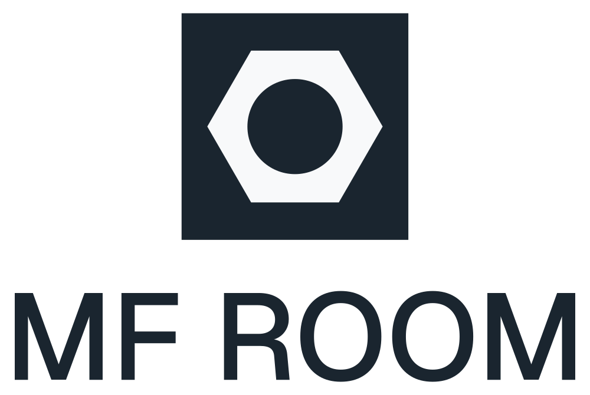
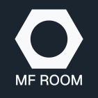

# MF Room Logo

Official logo of MF Room, designed by Julien and refined by Rosalie.

## Variants

### Horizontal lockup



### Square - full logo

| Light | Dark |
|:-----:|:----:|
|  |  |

### Mark only

| Light | Dark |
|:-----:|:----:|
|  |  |

## Exporting to PNG

Run `export_png.sh` with the desired width in pixels:

```bash
./export_png.sh 512
```

This exports all SVG variants as PNG files named `<variant>_<size>.png` (e.g. `logo_mark_512.png`).

## Specifications

| Property | Value |
|----------|-------|
| Hexagon / circle diameter ratio | **1.78** |
| Font | **Geist** |
| Primary color | `#1a252f` |
| Secondary color | `#f8f9fa` |
