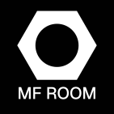

# MF Room Logo

Official logo of MF Room, designed by Julien and refined by Rosalie.

## Variants

### Horizontal lockup

### Square — full logo

| Light | Dark |
|:-----:|:----:|
|  |  |

### Mark only

| Light | Dark |
|:-----:|:----:|
|  |  |

## Specifications

| Property | Value |
|----------|-------|
| Hexagon / circle diameter ratio | **1.78** |
| Font | **Geist** |
| Primary color | `#1a252f` |
| Secondary color | `#f8f9fa` |
